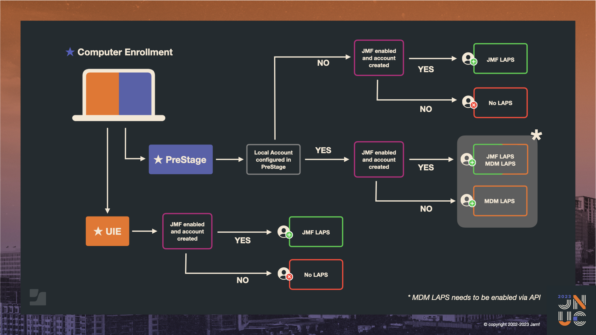

## The Good, the Bad, the ugly of local admin management

### *Additional Resources:*

- Bill Smith Tech Thoughts: https://community.jamf.com/t5/tech-thoughts/how-to-securely-manage-local-admin-passwords-with-jamf-pro-and/ba-p/289969
- Tom Koehler Tech Thoughts: https://community.jamf.com/t5/tech-thoughts/laps-enhancements-and-changes-to-the-uie-management-account/ba-p/297191
- 10.48 deprecation notice: https://learn.jamf.com/bundle/jamf-pro-release-notes-10.48.0/page/Deprecations_and_Removals.html
- https://support.apple.com/guide/deployment/dep24dbdcf9e/

## The PRK [Option + Shift + Return]

>On a Mac with Apple silicon using macOS 12.0. 1 or later, press Option-Shift-Return to reveal the entry field for the PRK, then press Return (or click the arrow). macOS starts up. There is only one PRK per encrypted volume, and during FileVault enablement from MDM, it can optionally be hidden from the user.

[Manage FileVault with mobile device management](https://support.apple.com/guide/deployment/manage-filevault-with-mdm-dep0a2cb7686/web#:~:text=On%20a%20Mac%20with%20Apple%20silicon%20using%20macOS%2012.0.,be%20hidden%20from%20the%20user.)

## The Flow

